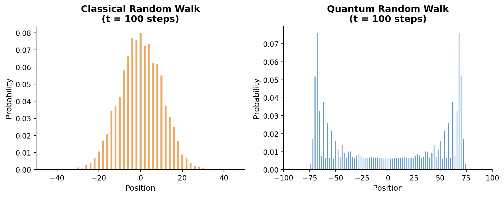

# Quantum Random Walks: A Guided Tour

> From coin flips to coherent superposition — and why it matters for algorithms.

An interactive Jupyter notebook that builds a discrete-time quantum walk on the 1-D integer lattice from scratch, compares it to the classical random walk, and explores the transition between them.



## What's inside

The notebook walks through the following, with simulations and visualizations at every step:

1. **Motivation** — why quantum mechanics forces us to use the Hadamard coin
2. **Classical random walk** — Monte Carlo simulation, Gaussian limit, σ ~ √t spreading
3. **Quantum walk simulation** — state vector evolution, ballistic spreading (σ ~ t/√2), bimodal distribution
4. **Direct comparison** — side-by-side distributions, σ(t) curves, spacetime heatmaps
5. **Initial coin state** — how |L⟩, |R⟩, and the symmetric state shape the distribution
6. **Decoherence** — continuously interpolating from quantum to classical by measuring the coin
7. **Discussion** — connections to Grover's algorithm, the Dirac equation, and Anderson localization

## Getting started

### Requirements

- Python 3.10+
- numpy
- matplotlib

### Install and run

```bash
git clone https://github.com/YOUR_USERNAME/quantum-random-walks.git
cd quantum-random-walks
pip install -r requirements.txt
jupyter notebook Quantum_Random_Walk_Full_Notebook.ipynb
```

## License

MIT
